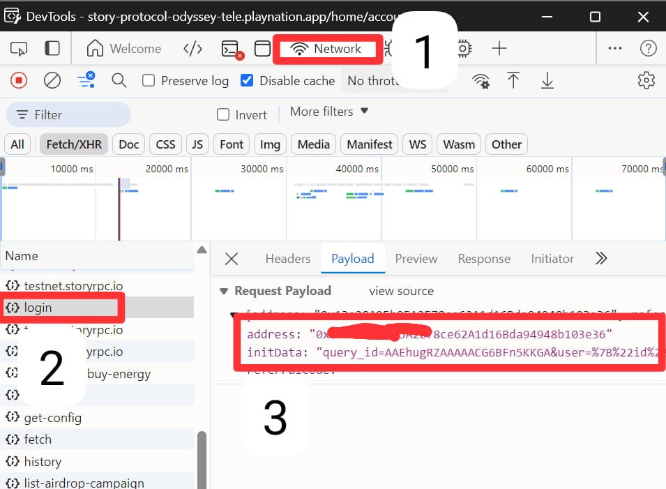

# Koni Story BOT
Koni Story BOT `[Added Soon]`

Register Here : [Koni Story](https://t.me/KoniStory_bot/app?startapp=TXpN3k91O)

## Fitur

  - Auto Get Account Information
  - Auto Completed Tasks
  - Multi Account

## Prasyarat

Pastikan Anda telah menginstal Python3.9 dan PIP.

## Instalasi

1. **Kloning repositori:**
   ```bash
   git clone https://github.com/vonssy/KoniStory-BOT.git
   ```
   ```bash
   cd KoniStory-BOT
   ```

2. **Instal Requirements:**
   ```bash
   pip install -r requirements.txt #or pip3 install -r requirements.txt
   ```

## Konfigurasi

- **accounts.json:** Anda akan menemukan file `accounts.json` di dalam direktori proyek. Pastikan `accounts.json` berisi data yang sesuai dengan format yang diharapkan oleh skrip. Berikut adalah contoh format file:

  ```bash
    {
        "Account": [
            {
                "query": "Your query_id= or user=",
                "address": "Your address"
            },
            {
                "query": "Your query_id= or user=",
                "address": "Your address"
            }
        ]
    }
  ```

- **How to Get query_id and address:** Buka DevTools atau alat sejenis, lalu ikuti gambar dibawah ini.

<div style="text-align: left;">
  <h4><strong>DevTools Screenshot</strong></h4>
  
</div>

## Jalankan

```bash
python bot.py #or python3 bot.py
```

## Penutup

Terima kasih telah mengunjungi repository ini, jangan lupa untuk memberikan kontribusi berupa follow dan stars.
Jika Anda memiliki pertanyaan, menemukan masalah, atau memiliki saran untuk perbaikan, jangan ragu untuk menghubungi saya atau membuka *issue* di repositori GitHub ini.

**vonssy**